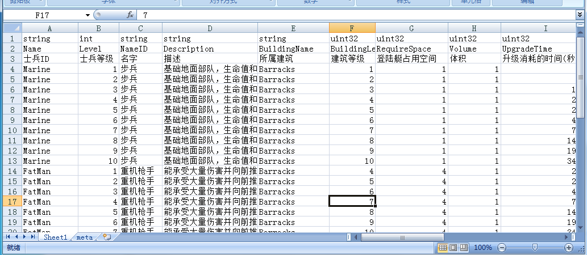

# taxi

老司机，带你飞

taxi是一个配置导出源码生成工具，旨在简化游戏逻辑开发中的数据抽象过程。

# 为什么要使用配置导出工具

当一个游戏项目进入大量的逻辑功能迭代开发的时候（即铺量的阶段），于程序员而言大多数开发内容可以认为就是CRUD操作的堆砌。

以一个大多数游戏中常见新手任务系统为例：

这个系统的规则就是当玩家达到一定的成长以后，比如升到指定等级、建造了指定数量的建筑或者击败指定的NPC后，给与一定奖励。

那么对程序员而言至少需要以下的API：
* 根据任务名称获取达成条件；
* 根据任务名称获取奖励内容；

这两个API的内容，都会在策划产出的配置表里。

在传统的方式下，如果手写这些配置的加载、读取代码，加上正确性测试，还有前后端非同一编程语言的情况，会把人力耗费在了一些边边角角上。

如果有这样的一个工具，能根据策划产出的配置文档格式，一键生成对应编程语言的数据结构和相关的加载、解析代码，则程序员在开发这个系统的时候，只需要跟策划确定配置表格式，然后运行一下导出，则前端可以开始撸UI表现，后端可以开始撸传输、存储，大大地提升程序开发效率。

# taxi的设计

* taxi关注的是两个点，即导入和生成，对应代码中的设计有定义导入器(importer)和生成器(generator)，导入器把数据导为一个描述格式(descriptor)，生成器根据描述格式生成对应编程语言的代码；

* taxi的设计目标是用精简合适的方案解决实际问题，不希望做成大而全框架，也就是在用其它格式（比如JSON）来做配置表更合适的时候请勿执着于excel；

* taxi使用python3编写，依赖[openpyxl](https://openpyxl.readthedocs.io/)和[pymysql](https://github.com/PyMySQL/PyMySQL)，借助[pyinstaller](http://www.pyinstaller.org/)可以打包为执行档发布；

目前支持了2种类型的导入器：

## 导入MySQL
这个模式是把MySQL里的table导出为一个结构体定义，并生成相应的Select, Insert和Update语句。

这个模式的目的，一个是减少手写SQL容易带来的错误，二个是旨在做一个简单的对象关系映射(ORM)。

## 导入Excel
这个模式把excel表格导出为代码和数据配置。

按taxi的规则，一个excel配置表包含了两大内容，一个是对数据的定义，包括每一列的名称、类型等，还有一些配合导出的选项，二个是数据本身。

数据定义部分将会导出为结构及相关函数代码定义，而数据本身将会转为另一个csv格式的文件。

# 如何使用taxi导出数据

一个符合taxi规则的excel表格如下图所示：

前3行代表这一列的数据类型定义，从第4行开始为数据内容。

另外，每一个excel表格都必须带有一个名为**meta**的sheet，在这个sheet里定义相关的程序导出参数。

请查看examples目录下的示例：

* [示例1](examples/basic) 演示excel配置的基础用法，导出为C#(Unity);
* [示例2](examples/global-var) 演示如何配置全局参数表，导出为C++;
* [示例3](examples/array-map) 演示如何使用array和map类型，导出为Go;
* [示例4](examples/inner-class) 演示如何在excel内部再定义嵌入类型，导出为Java;
* [示例5](examples/sql) 演示如何从MySQL数据库导出代码，导出为Go;

# TO-DO

* 支持版本兼容性

