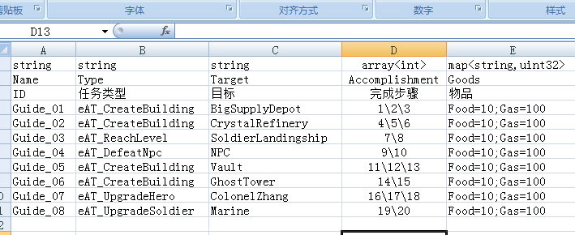

## array和map类型演示

双击`导出Go.bat`文件即可导出Go代码，需要依赖Python, openpyxl, pymysql

taxi支持将一列数据的类型配置为数组或者是键值对格式，也就是对应的array和map，配置格式参考C++语法，使用array<int>或者map<string,int>即可。
如下图所示：

## 配置详解

### meta表里的配置

* `array-delim` 配置数组分隔符，默认为`\`符号
array类型的配置就是把多项配置加上分隔符，如 `Value1\Value1\Value1`

* `map-delim` 配置键值对分隔符，默认为`=;`
map类型的配置是多个key-value的聚合，如`Key1=Value1;Key2=Value2;Key3=Value3`