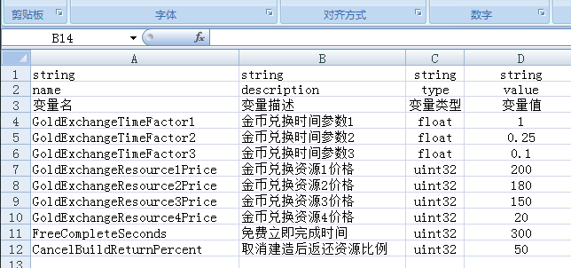

## 全局变量表模式的读取

双击`导出C++.bat`文件即可导出C++代码，需要依赖Python, openpyxl, pymysql

全局参数表，顾名思义，是为了读取一些全局的配置项，在配置形式上跟普通模式有一点区别，它是纵向读取的，并且整个数据内容在程序代码中是保存在一个单件(singleton)对象里。
 
配置格式如图：

## 配置详解

### meta表里的配置
* `class-name` 生成的类名称
* `class-comment`   全局数值配置
* `key-value-column` 参数名称和参数值所在的列，以逗号分隔
* `value-type-column`  参数值类型所在列
* `comment-column`  参数注释所在列